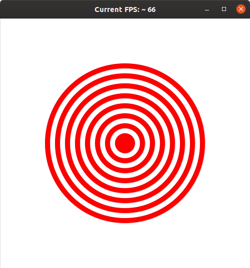

# U08 | Zielscheibe

## **Zielscheibe**

In dieser Aufgabe sollen Sie eine Zielscheibe auf dem Bildschirm
zeichnen:

| Die Zielscheibe. |
|:----:|
|  |

Die Zielscheibe muss aus 15 Ellipse-Objekten bestehen und im Zentrum des Bildschirms gezeichnet werden. Der mittlere Ring ist rot und hat einen Durchmesser von 10, die Farben wechseln sich dann nach außen hin ab. Der Durchmesser jedes weiteren Rings entspricht dem seines Vorgängers, erhöht um den Durchmesser des ersten Rings.  Legen Sie für die Anzahl der Ringe und den Durchmesser des innersten Rings geeignete Konstanten an, und testen Sie, ob Ihr Programm auch mit anderen Werten einwandfrei funktioniert. Legen Sie weitere Konstanten an, um Ihren Code robuster gegen Veränderungen zu machen.

**Tipp:** Die Ringe werden übereinander gezeichnet, d.h. Sie müssen mit dem äußersten Ring anfangen, um zu vermeiden, dass die kleineren Ringe verdeckt werden.
